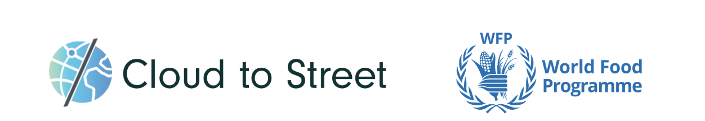

# **[Cloud to Street](https://www.cloudtostreet.info/) (for [WFP](https://www1.wfp.org/)):**

Cloud to Street is the leading dynamic flood mapping system designed to enable the world's most vulnerable communities to prepare for and respond to climate catastrophes. We harness global satellites, machine learning, and community intelligence to monitor floods in near realtime around the world and remotely analyze local flood exposure at a fraction of the cost and time of traditional flood mapping. Our mission is to ensure that all vulnerable governments can finally access the high quality information they need to prepare and respond to increasing catastrophes. Today 11 national governments are using Cloud to Street and we are on track to enable new flood protection and insurance for 10 million people in the next 5 years.

We are currently partnering with The World Food Programme in Sri Lanka to provide an online decision support tool and flood alert system for the national government.

# **Core challenge:**

Developing country governments are rarely the focus of world class user experiences or human centered design processes. Yet, good product design makes all the difference in enabling an emergency decision-maker to understands the information they need to in order to act, as opposed to confusing them or preventing them from leveraging critical feedback on the disaster. Cloud to Street has started to do things differently. However, we do not have the expertise in human centered design that we are sure would fully build out the ideal experience for these government users.

We are looking for help from a user experience and human centered design expert to turn our scientific information and technical disaster support tool into an easy-to-use and highly trusted product for the government decision makers, first responders, and vulnerable communities we serve. We need guidance and fresh ideas for developing the next level of our information design vision for the product and prototyping a trusted, intuitive, and immediately useful information service.

# **Current organization tech stack**

- Online dashboards customized for each client with reports on each flood event of concern and web maps with all long term and near realtime data for their area
- WhatsApp messages to a focal group or main point person
- 1 week in person trainings and user design exercises with the government to establish the information flow between the stakeholders and the emergency decision-making process
- Virtual trainings on our data and how to leverage the insights for their specific decisions

Example:

- React front end, Python/Django backend, Redis + Postgres db, on AWS EC2+RDS, etc.
- CNN model for topic prediction (using fastText library) on AWS Lambda (managed with Serverless Framework)
- Admin reporting tools: some in Django app, some sent to Google Sheets via Google Docs API.

**Phase 1 - User Experience Definition**

**Description**

Help us develop a vision for the user experience of our disaster users by guiding us and providing feedback as we further define the problems and goals, map the user journeys, and more. Sketch a user flow for our disaster information process for our flood information online UI and push notification messaging for the Sri Lankan government. Help us deploy tests of different designs of the dashboard and style of the messages with the various government stakeholders in Sri Lanka.

**Skills**

- Human centered design
- User research
- Wireframe development

**Impact**
We will use this to revamp the user experience for the Sri Lankan government around flood information.

**Timeline**
August through September

**Phase 2 - User Experience Wireframing**

**Description**
Create wireframes and guidance for the messages for our developers to use based on the outcomes of the project above

**Skills**

- Human centered design
- User research
- Wireframe development

**Impact**
We will use this to redo the user experience for the Sri Lankan government around flood information

**Timeline**
August through September

**Phase 3 - User Experience KPIs and Tracking**

**Description**
Help us develop a set of KPIs around UX

**Skills**

- User research
- Metrics and Evaluation

**Impact**
We will use this process to determine the essential elements of our user’s experience with us and plan what product optimization

**Timeline**
August through October

**What to expect?**

We have a current dashboard and other communications processes, as well as a high level strategy document outlining the goals of the user’s experience of our product. We expect the volunteer to do a thorough review of our dashboard and other communications to the Sri Lankan government by using our material and talking with us. We’d also like a few sessions where they lead us through questions we should consider when researching our users. They should iteratively provide suggestions over the phone, in writing and as drawn wireframes that we can immediately develop and test out with user. Ideally, we would do 2-3 rounds of build, test, feedback with the volunteer.

**Next Steps (filled by Ovio)**

You love this organization and their projects? Send us an email now and will introduce you to the right person.

<!-- Docs to Markdown version 1.0β17 -->
